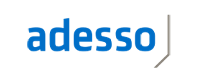
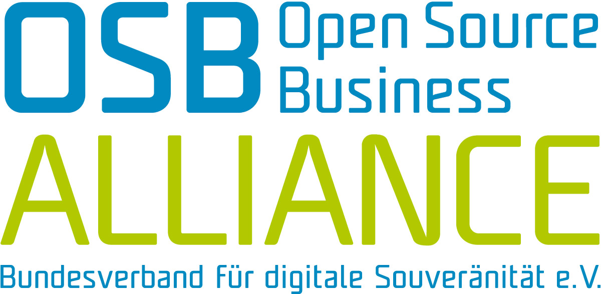
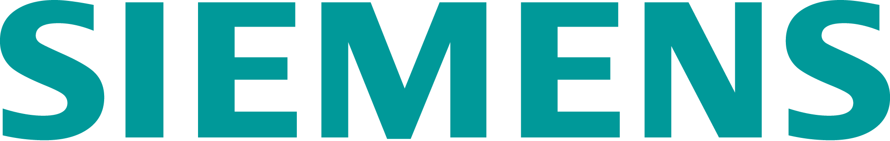
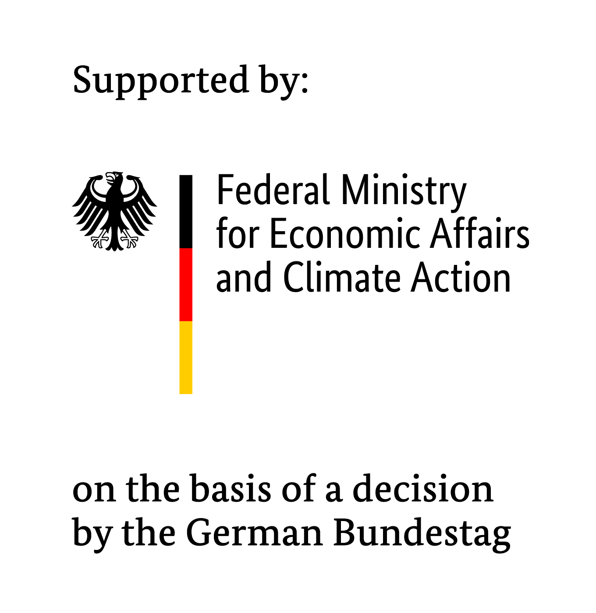

## Enabling green COmputing and DIGItal Transformation
The main result of the project is the development, validation and provision of an automated evaluation environment (test bed) that transparently discloses key figures and data on resource consumption, CO2e emissions, etc. for software applications that can be tested at will.
To achieve this, an assessment method is first developed to determine the main environmental impacts of software applications and to define suitable indicators for measuring them. These indicators can be, for example, the power consumption of the working environment, the use of hardware resources, but also other indicators such as the amount of raw materials and chemicals for hardware production. The method development also includes a suitable form of presentation of the environmental impacts associated with the software using key figures.
An overarching goal of the project is to create transparency, objectivity and standardisation with regard to the evaluation of resource consumption when using any software solution. To this end, the test bench should be able to consider mobile apps and desktop applications as well as distributed systems and cloud- native applications in a platform-independent manner. Finally, the test bench will also be made widely available in the post-project phase. The stated aim of the project is to develop a standard for the methodology for assessing the environmental impact of digital technologies.

[Press release](https://gi.de/aktuelles/projekte/eco-digit)

[Mailing list](https://lists.gi.de/postorius/lists/eco-digit-public.lists.gi.de/)

## Project Partners

## Contributors

## Funding

